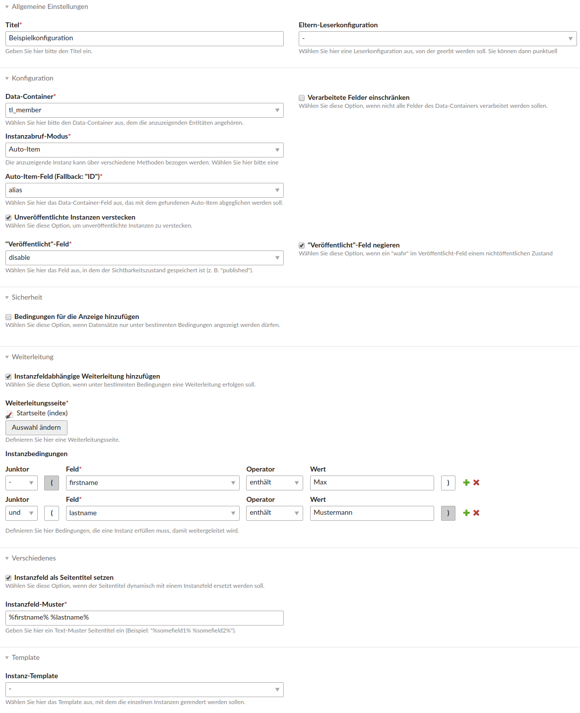

# Contao Reader Bundle


[](https://travis-ci.org/heimrichhannot/contao-reader-bundle)
[](https://coveralls.io/github/heimrichhannot/contao-reader-bundle?branch=master)

This bundle offers a generic reader module to use with arbitrary contao entities containing standard reader specific functionality like field output, images and auto_item handling.

## Features

- generic reader module: output entities of arbitrary DCA entities
- dedicated and inheritable reader config entities that can be assigned to one or many modules
- twig support for templates

*Hint: This module can greatly be used with [heimrichhannot/contao-list-bundle](https://github.com/heimrichhannot/contao-list-bundle) which can display lists of arbitrary DCA entities*

## Impressions

### Reader configuration



## Concepts

### Inheritable reader configuration

Since reader configuration can be lots of data sometimes we decided to outsource it into a dedicated DCA entity.
These entities can be assigned to one or even multiple reader modules in a reusable way.

In addition it's possible to create reader configs that inherit from other reader configs.
Hence overriding a single option while keeping everything else is possible.

### Reader config elements

Every reader config can have one or more reader config elements. These are designed to specify things that can occur multiple times (e.g. because there are many fields of one type).

Currently available reader config element types:

Type          | Description
--------------|------------
image         | Configure the output of one or more image fields separately (image size, placeholder handling, ...)
tags          | Output one or more tag fields based on [codefog/tags-bundle](https://github.com/codefog/tags-bundle).
related items | Output related items based on given tags (needs [heimrichhannot/contao-list-bundle](https://github.com/heimrichhannot/contao-list-bundle); needs [codefog/tags-bundle](https://github.com/codefog/tags-bundle)) or categories (needs [heimrichhannot/contao-categories-bundle](https://github.com/heimrichhannot/contao-categories-bundle)).

### Templates

There are two ways to define your templates. 

#### 1. By Prefix

The first one is to simply deploy twig templates inside any `templates` or bundles `views` directory with the following prefixes:

- `reader_item_`
- `item_`
- `news_`
- `event_`

**More prefixes can be defined, see 2nd way.**

#### 2. By config.yml

The second on is to extend the `config.yml` and define a strict template:

**Plugin.php**
```
<?php

class Plugin implements BundlePluginInterface, ExtensionPluginInterface
{
    /**
     * {@inheritdoc}
     */
    public function getBundles(ParserInterface $parser)
    {
        …
    }

    /**
     * {@inheritdoc}
     */
    public function getExtensionConfig($extensionName, array $extensionConfigs, ContainerBuilder $container)
    {
        return ContainerUtil::mergeConfigFile(
            'huh_reader',
            $extensionName,
            $extensionConfigs,
            __DIR__ .'/../Resources/config/config.yml'
        );
    }
}
```

**config.yml**
```
huh:
    reader:
        templates:
            item:
                - { name: default, template: "@HeimrichHannotContaoReader/reader_item_default.html.twig" }
            item_prefixes:
                - reader_item_
                - item_
                - news_
                - event_
```

### Syndications

Syndications as links that share the article with other social networks or provide print or pdf export.

#### PDF-Syndication

##### Use custom fonts  

Inside each tl_reader_config_element.syndicationPdfFontDirectories you can provide multiple paths to a directory containing additional fonts.
The directory **must contain** a `mpdf-config.php` file, that must return an array with the additional mpdf font-configuration.

**Example:**

You declare for instance the direcory `files/pdf-fonts/` that contains the `.ttf` or `.otf` or `.ttc` font files and the `mpdf-config.php`, than the following configuration should be made. 

```
<?php

$defaultFontConfig = (new Mpdf\Config\FontVariables())->getDefaults();
$fontData          = $defaultFontConfig['fontdata'];

return [
    'fontdata'     => $fontData +[
        'roboto'      => [
            'R' => 'Roboto-Regular.ttf'
        ],
        'fontawesome' => [
            'R' => 'fontawesome-webfont.ttf'
        ]
    ],
    'default_font' => 'roboto'
];
``` 
*Example: mpdf-config.php*

More Information: https://mpdf.github.io/fonts-languages/fonts-in-mpdf-7-x.html

## Developers

### Events

Class | Name | Description
----- | ---- | -----------
RenderTwigTemplateEvent | huh.utils.template.render | Will be fired before the reader item is rendered (in DefaultItem). If you've overriden the parse method in an custom item class, you need to implement the event dispatcher by yourself. The event is located in [Utils Bundle](https://github.com/heimrichhannot/contao-utils-bundle) and used here for better bundle interoperability.


### List config elements

It is easy to add new list config elements.

1. Create a class that implements `HeimrichHannot\ReaderBundle\ConfigElementType\ReaderConfigElementTypeInterface`
1. Register the class as service with service tag `huh.reader.config_element_type`
1. Add a friendly type name (translation) into the `$GLOBALS['TL_LANG']['tl_reader_config_element']['reference']` variable

    ```php
    $lang['reference'][\HeimrichHannot\ReaderBundle\ConfigElementType\CommentConfigElementType::getType()] = 'Comment';
    ```
